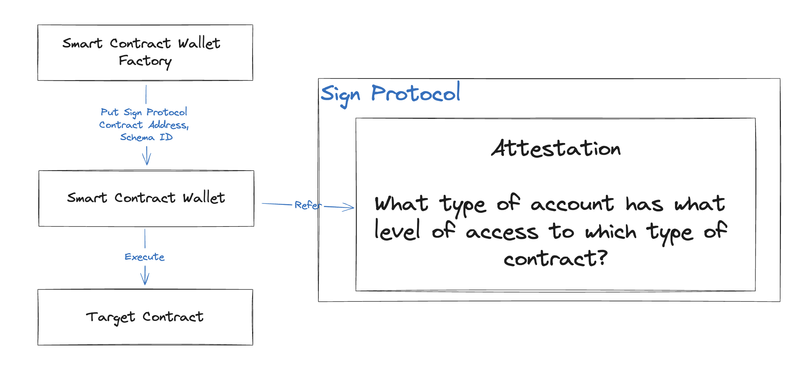

# DeleGate

DeleGate is a smart contract wallet with attestation-based role management.

## Live Demo

https://delegate-wallet-nine.vercel.app/

## Video

https://youtu.be/WZqBXYWT4e0

## Description

DeleGate utilizes the Sign Protocol's attestation to manage the roles of smart contract wallets. Only accounts with attestation can execute certain functions.

## How it works

- Smart contract Wallet Factory puts Sign Protocol's address, schema ID into smart contract wallet
- Smart contract wallet refers Sign Protocol's attestations to get what type of account has what level of access to which type of contract.
- If the all conditions match, the smart contract wallet execute target contract function

## Key Benefits

### Automation

DeleGate automates crucial wallet operations, enabling seamless transaction flows and interactions without manual oversight. This automation reduces human error and increases the efficiency of decentralized operations.

### Team Management

With role-based access control, DeleGate facilitates comprehensive team management. It allows organizations to define and enforce precise access controls and roles, making it ideal for managing large teams and multi-tiered permissions structures in decentralized projects.

### Transparency

Transparency is at the core of DeleGate. All transactions and access permissions are recorded on the blockchain, providing a clear and immutable audit trail. This transparency ensures that all actions are traceable and verifiable, enhancing trust and security for all users.

## Future Roadmap

- Integrate ERC4331 Account Abstraction
- Integrate EIP3074 AUTH and AUTHCALL opcodes after Pectra update

## References

### DeleGateWallet

https://sepolia.arbiscan.io/address/0xace60f81c4a302a9a80f4ffed7356b3acd781aee#code

### DeleGateWalletFactory

https://sepolia.arbiscan.io/address/0x8866b847258a994ce45cdf7dedcfb9b0692cc157#code

### SampleTargetContract

https://sepolia.arbiscan.io/address/0xb0dad68179d4a4714c28f3adf1a6dd7be1c8b330#code

### Created Attestation

https://testnet-scan.sign.global/attestation/onchain_evm_421614_0x49
